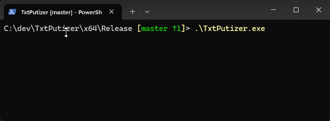
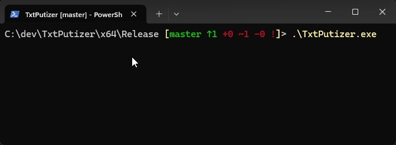
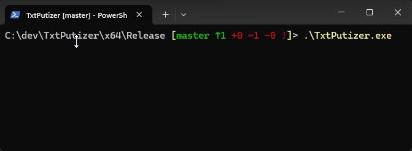

TxtPutizer is a lightweight, interactive textual UI library.
It provides various menu options for different types and representations of user interactions, allowing the selection of options and capturing user input in a straightforward and convenient manner.

### Features
The menus are controlled via:
* arrow keys - for navigation between presented options.
* spacebar - for selecting the option pointed by the cursor.
* enter - exits the menu.

Currently, TxtPutizer supports 3 types of menus:
- **checkbox menu** - Allows the user to select any number of options from a vertical list.

- **radio menu** - Allows the user to choose one option from a vertical list of options. Selecting an option deselects any previously selected option.

- **prompt menu** - A single-line prompt for selecting one option from a horizontal list, ideal for short questions such as yes/no.

**Note: More menu variations may be added in the future.*

Any further requests, ideas, and conributions are very welcome.

## Integration
TxtPutizer is designed with as easiest integration into any project as possible in mind. The entire library is contained within a single header file: [`TxtPutizer.hpp`](https://github.com/RuBublik/TxtPutizer/blob/master/TxtPutizer/single_include/TxtPutizer/TxtPutizer.hpp), requiring no modifications to your project settings.

### Usage
For usage examples, refer to [`here`](https://github.com/RuBublik/TxtPutizer/blob/master/TxtPutizer/tests/MainTest.cpp) file in this repository.

***
Feel free to reach out with any questions or suggestions!